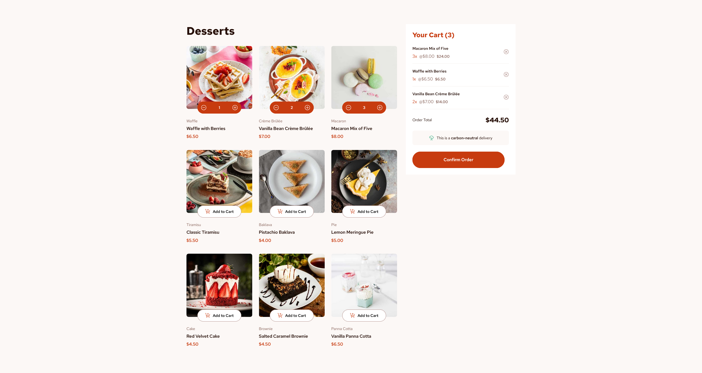

# 🍰 Dessert Shop – React E-Commerce UI

A responsive, animated dessert shop frontend built with **Vite**, **React**, and **TypeScript**. Users can browse a curated list of desserts, add items to a cart, and confirm orders with a smooth, animated checkout experience.



## 🚀 Features

- 🛍️ **Product Grid** — Clean, responsive layout of dessert products with dynamic image sources per device size built with CSS Grid.
- 🛒 **Shopping Cart** — Add/remove items with quantity tracking and real-time price updates.
- ✅ **Order Confirmation Modal** — Smoothly animated modal for displaying an order confirmation to the user.
- 🎨 **Responsive Design** — Mobile-first styling with SCSS.
- ⚙️ **Modern Tech Stack** — Vite, React, TypeScript, SCSS, Framer Motion.

---

## 🧱 Tech Stack

| Tool            | Purpose                                      |
|-----------------|----------------------------------------------|
| [Vite](https://vitejs.dev/)         | Fast dev server & build tool                 |
| [React](https://reactjs.org/)       | UI Library                                  |
| [TypeScript](https://www.typescriptlang.org/) | Type-safe JavaScript                         |
| [SCSS](https://sass-lang.com/)      | Styling with variables and nesting          |
| [Framer Motion](https://www.framer.com/motion/) | Animations and transitions                  |

---

## 📦 Getting Started

### 1. Clone the repo

```bash
git clone https://github.com/yourusername/dessert-shop.git
cd dessert-shop
```

### 2. Run the build

```bash
npm run dev
```